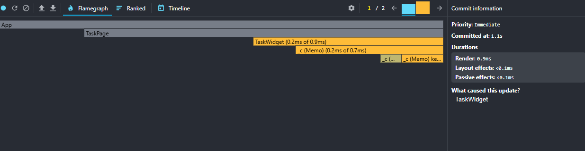

TaskCard после обёртки в memo карточки перестал перерисовываться при смене фильтра и удалении других задач

# анализ
1) TaskList ререндерится при любом изменении состояния но ограничивается сранвением пропсов.
2) filterButton перерисовывается при клике, оптимизировал путём обёртки их сеттеров и в memo

прошу проверить файл(пометил тудушкой) `TaskList` не избыточна ли обёртка для filterButton?

